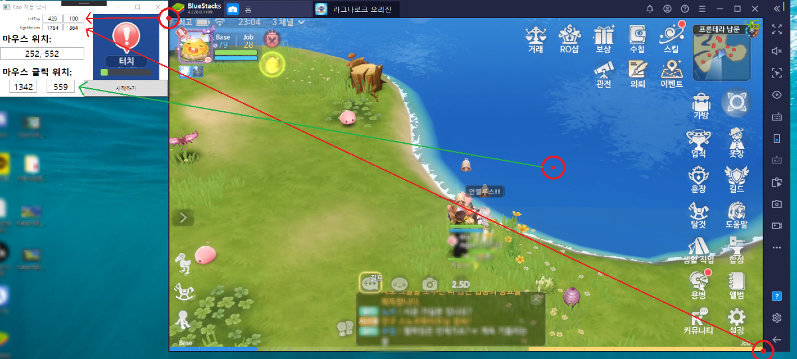

# ROO(Ragnarok Online Origin) Contents Macro
> 라그나로크 오리진 관련 컨텐츠 매크로 프로그램입니다.  


## 최신 버전 다운로드
* 0.1.0- [Download](https://github.com/Jooss287/ROO_Contents_Macro/releases/tag/v1.0)
    * First Release

## 설치 방법

윈도우:
```
1. Release File 다운로드
2. exe 파일 실행
3. 사용 예제에 따라 사용 후 버튼 클릭
4. 1~2회 매크로 정상 동작 확인
```

## 사용 예제

프로그램의 마우스 위치 정보를 이용하여 앱플레이어의 왼쪽 상단과 우측 상단, 클릭 할 위치를 입력합니다.



## 개발 환경

Tools: Visual studio 2019  
Language: C#, WPF  
Opensource: EMGU.CV ( OpenCV )  

**Pull Requeat**는 언제나 환영합니다.

## 정보

Joo Seongsoo – Jooss287@gmail.com

MIT 라이센스를 준수하며 ``LICENSE``에서 자세한 정보를 확인할 수 있습니다.

[https://github.com/Jooss287](https://github.com/Jooss287)

## 기여 방법

1. (<https://github.com/Jooss287/ROO_Contents_Macro>)을 포크합니다.
2. (`git checkout -b feature/fooBar`) 명령어로 새 브랜치를 만드세요.
3. (`git commit -am 'Add some fooBar'`) 명령어로 커밋하세요.
4. (`git push origin feature/fooBar`) 명령어로 브랜치에 푸시하세요. 
5. 풀리퀘스트를 보내주세요.